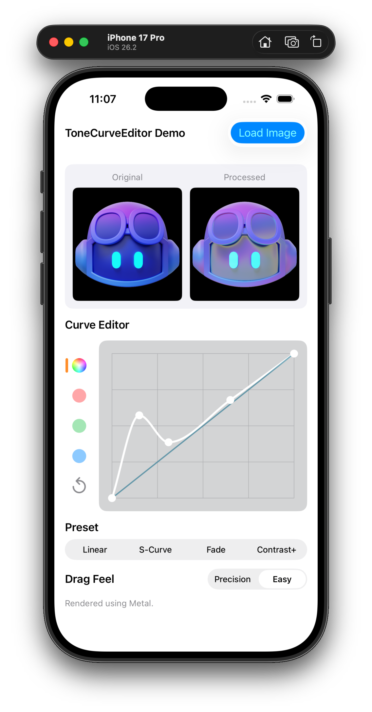
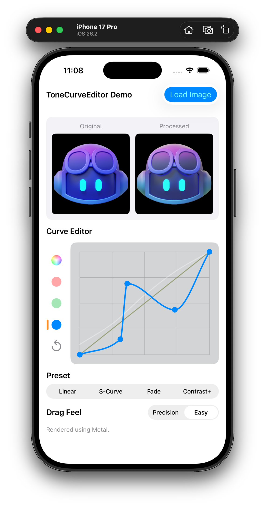

# ToneCurveEditor

`ToneCurveEditor` 是一个 iOS 15+ 的 Tone Curve 编辑库（SwiftPM），包含：
- Master 全局曲线
- RGB 分通道曲线
- 控制点拖拽编辑
- LUT 采样与渲染（Metal 优先，CIColorCube 回退）

## 平台与依赖
- iOS 15.0+
- Swift 5.10+
- 无第三方运行时依赖

## 项目结构
- `Sources/ToneCurveEditor/Core`: 曲线模型、通道集合、采样与 LUT
- `Sources/ToneCurveEditor/UI`: 编辑器视图、几何映射、路径构建
- `Sources/ToneCurveEditor/Rendering`: 渲染后端与引擎
- `Demo`: UIKit Demo App
- `Tests/ToneCurveEditorTests`: SwiftPM 测试（Core / UI / Rendering）
- `DemoTests`: Demo 集成烟测

## 快速开始
1. 生成 Demo 工程：
```bash
xcodegen generate
```
2. 在 Xcode 打开 `ToneCurveEditorDemo.xcodeproj`。
3. 运行 `Demo` scheme 体验编辑与渲染链路。

## 截图
| Demo 首页 | 曲线编辑与预览 |
| --- | --- |
|  |  |

## SwiftPM 集成
在业务项目 `Package.swift` 中添加：
```swift
.dependencies([
    .package(url: "https://your-repo-url.git", from: "0.1.0")
]),
targets: [
    .target(
        name: "YourTarget",
        dependencies: [
            .product(name: "ToneCurveEditor", package: "ToneCurveEditor"),
        ]
    )
]
```

## 最小示例
```swift
import UIKit
import ToneCurveEditor

final class DemoViewController: UIViewController {
    private let editorView = ToneCurveEditorView()
    private let renderEngine = try? ToneCurveRenderEngine(backendPreference: .metalPreferred)

    override func viewDidLoad() {
        super.viewDidLoad()
        editorView.curveSet = .identity
        editorView.activeChannel = .master
        editorView.addTarget(self, action: #selector(curveDidChange), for: .valueChanged)
    }

    @objc
    private func curveDidChange() {
        // 使用 editorView.curveSet 更新预览或导出链路
    }
}
```

## 测试策略
- Core 细粒度单测：`Tests/ToneCurveEditorTests/Core`
- UI 几何与命中：`Tests/ToneCurveEditorTests/UI`
- Rendering 与性能基准：`Tests/ToneCurveEditorTests/Rendering`
- Demo 集成烟测：`DemoTests/ToneCurveEditorSchemeTests.swift`

## 开发规范
- 格式化配置：`/.swiftformat`
- 统一格式化命令：
```bash
swiftformat .
```
- Agent 协作约束：`/AGENTS.md`

## 文档
- 性能基线：`docs/PerformanceBaseline.md`
